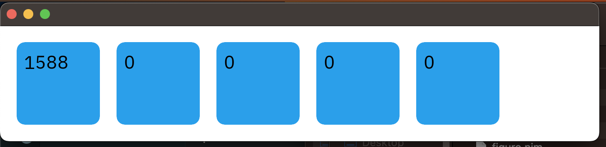

# Figuro

A GUI toolkit for Nim that is event driven while being small and fast. It tries to incorporate the best elements of both imperitive and object oriented GUI toolkits. Originally based on Fidget it now has a multi-threaded core and improved event system. All widgets are typed and can contain their own state.

*Warning*: Figuro is still in an *alpha* stage and code and apis will be in flux. Some pieces still aren't completed.

## Example

Example drawing buttons with a fading background when any of them are hovered (see below for how it works):

```nim
let
  typeface = loadTypeFace("IBMPlexSans-Regular.ttf")
  font = UiFont(typefaceId: typeface, size: 22)

type
  Main* = ref object of Figuro
    bkgFade* = FadeAnimation(minMax: 0.0..0.15,
                             incr: 0.010, decr: 0.005)

proc update*(fig: Main) {.signal.}

proc btnTick*(self: Button[int]) {.slot.} =
  ## slot to increment a button on every tick 
  self.state.inc
  refresh(self)

proc btnClicked*(self: Button[int],
                  kind: EventKind,
                  buttons: UiButtonView) {.slot.} =
  ## slot to increment a button when clicked
  ## clicks have a type of `(EventKind, UiButtonView)` 
  ## which we can use to check if it's a mouse click
  if buttons == {MouseLeft} or buttons == {DoubleClick}:
    if kind == Enter:
      self.state.inc()
      refresh(self)

proc btnHover*(self: Main, evtKind: EventKind) {.slot.} =
  ## activate fading on hover, deactive when not hovering
  self.bkgFade.isActive(evtKind == Enter)
  refresh(self)

proc draw*(self: Main) {.slot.} =
  ## draw slot for Main widget called whenever an event
  ## triggers a node or it's parents to be refreshed
  nodes(self):
    node.setName "main"

    # Calls the widget template `rectangle`.
    # This creates a new basic widget node. Generally used to draw generic rectangles.
    rectangle "body":
      with node:
        # sets the bounding box of this node
        box 10'ux, 10'ux, 600'ux, 120'ux
        cornerRadius 10.0
        # `fill` sets the background color. Color apis use the `chroma` library
        fill whiteColor.darken(self.bkgFade.amount)

      # sets up horizontal widget node with alternate syntax
      Horizontal.new "horiz": # same as `horizontal "horiz":`
        with node:
          box 10'ux, 0'ux, 100'pp, 100'pp
          # `itemWidth` is needed to set the width of items
          # in the horizontal widget
          itemWidth 100'ux, gap = 20'ui
          layoutItems justify=CxCenter, align=CxCenter

        for i in 0 .. 4:
          Button[int].new("btn", captures(i)):
            let btn = node
            with node:
              size 100'ux, 100'ux
              connect(doHover, self, btnHover)
              connect(doClick, node, btnClicked)
            if i == 0:
              connect(self, update, node, btnTick)

            text "text":
              with node:
                fill blackColor
                setText({font: $(btn.state)}, Center, Middle)

proc tick*(self: Main, tick: int, time: MonoTime) {.slot.} =
  ## handles background "fade" when buttons are hovered
  self.bkgFade.tick(self)
  emit self.update()

var main = Main.new()
app.width = 720
app.height = 140
startFiguro(main)
```



Currently during the early development only Atlas with `atlas.lock` files are intended to work. Nimble lock files are updated but may or may not work.

Eventually these issues will be resolved.

## Render Engine

Once the UI Application has finished drawing, it "serializes" the UI Figuro Nodes into a flattened list of Render Nodes. These Render Nodes are designed to be fast to copy by reducing allocations.

This will enable the render enginer to run on in a shared library while the widget / application layer runs in a NimScript.

## Widget Model

The GUI model builds on Figuro nodes. Each node has a basic set of properties that can be set and a core set of events and methods. Figuro nodes can also have children. Overall it's similar to HTML DOM nodes.

Widgets can be create by sub-classing the `Figuro` node type and providing a custom `draw` method (slot). The common way to create a Figuro app is creating a `Main` widget.

Here's a minimal example of creating a blue rectangle:

```nim
type
  Main* = ref object of Figuro

proc draw*(self: Main) {.slot.} =
  nodes(self):
    rectangle "body":
      # each widget template injects a new `node` variable
      # that references the current widget

      # sets the bounding box of this node
      box node, 10'ux, 10'ux, 600'ux, 120'ux

      # set the fill color
      fill node, css"00001F"

var main = Main.new()
app.width = 720
app.height = 140
startFiguro(main)
```

The `nodes` template sets up the needed vars for creating nodes. The `rectangle` widget template sets up a basic widget. Widget templates create a new node, adds it as a child to the current node, and sets up the callbacks needed for a node. 

It's possible to manually create nodes, but it's not encouraged. Although it can be handy to understand the how it works. The blue rectangle example roughly expands to:

```nim
proc draw*(self: Main) {.slot.} =
  var node {.inject.} = self

  block:
    # rectangle "body":
    let parent {.inject.}: Figuro = node
    var node {.inject.}: `widgetType` = nil
    preNode(BasicFiguro, "body", node, parent)
    node.preDraw = proc (c: Figuro) =
      let node {.inject.} = `widgetType`(c)
      ...
      # sets the bounding box of this node
      box node, 10'ux, 10'ux, 600'ux, 120'ux
      fill node, css"00001F"
    postNode(Figuro(node))
```

### Alternate Widget Syntax

There's an alternative syntax that builds on a specialized `new` template. It works the same as above, but makes it a bit more clear that new widget nodes are being created:

```nim
proc draw*(self: Main) {.slot.} =
  nodes(self):
    BasicFiguro.new "body":
      with node:
        box 10'ux, 10'ux, 600'ux, 120'ux
        cornerRadius 10.0
        fill whiteColor.darken(self.hoveredAlpha)
      horizontal "horiz":
        offset node, 10'ux, 0'ux
        itemWidth node, cx"min-content", gap = 20'ui
        for i in 0 .. 4:
          Button[int].new "btn", captures(i):
            with node:
              size 100'ux, 100'ux
              # we need to connect the nodes onHover event
              connect(doHover, self, buttonHover)
```

Currently both syntaxes are supported and can be mixed and matched.

## Signals and Slots

Figuro uses signals and slots as more generic "methods" in place of callbacks. 

They allow you to connect and disconnect signals at runtime which allows adaptable event handling. Signals and slots are shamelessly stolen from QT.

There are four main pieces to using slots and signal: `signal`, `slot`, `connect`, and `emit`. 

The `signal` pragma defines the procs as signals with the signal type being equivalent to the rest of the arguments after the first one. The first argument must be a subclass of the `Agent` object. `Figuro` objects already subclass `Agent` so all `Figuro` objects can be used with signals and slots.

The `slot` pragma transforms the proc into a signal handler. It can still be called as a regular proc as well. The first argument must be an `Agent` object such as a `Figuro` widget node.

Next `connect` is a template of type `template connect*(sender: Agent, sig: Signal, target: Agent, slot: Slot)`. It connects any matching signals from the `sender` object to the `target` object. `connect` is typed and checks that the signal and the slot types match. However, slots that don't take arguments can be connect if you pass `acceptVoidSlot=true` argument to connect.

Lastly, `emit` takes an agent object and sends a signal to each `slot` object connected to that object.

```nim
import figuro
type
  Counter* = ref object of Figuro
    value: int
    avg: int

proc valueChanged*(tp: Counter, val: int) {.signal.}
proc avgChanged*(tp: Counter, val: float) {.signal.}

proc setValue*(self: Counter, value: int) {.slot.} =
  echo "setValue! ", value
  if self.value != value:
    self.value = value
  emit self.valueChanged(value)

proc value*(self: Counter): int =
  self.value

var
  a {.used.} = Counter()
  b {.used.} = Counter()
connect(a, valueChanged,
        b, setValue)
## or equivalently:
## connect(a, valueChanged,
##         b, Counter.setValue())
a.setValue(42)
assert a.value == 42
assert b.value == 42
```

## Installation - Trying it out

Note that you *have* to follow these instructions for now. Using the normal Atlas installation *won't* give you the correct packages.

```sh
# recommended to install an up to date atlas
nimble install 'https://github.com/nim-lang/atlas@#head'

# new atlas workspace
mkdir fig_ws && cd fig_ws
atlas init --deps=vendor

# get deps
git clone https://github.com/elcritch/figuro.git

# sync deps
atlas replay --cfgHere --ignoreUrls figuro/atlas.lock
nim c -r figuro/tests/tclick.nim
```

## Goal

Massive profits and world domination of course. ;) Failing that the ability to write cool UI apps easily, in pure Nim.

## More Docs

Initial docs section.

### Useful Compilation Flags

- `-d:debugLayout` prints a node tree with the layout of each node before and after computing a layout
- `-d:debugEvents` prints the events received from Windy and which nodes got the events

### Drawing model

Each widget must inherit from the `Fidget` type. `Fidget` itself inherits from `Agent` which means it can work with signals & slots.

Each widget is composed of a `draw` slot and a widget-macro which is exported using `exportWidget`. Draw slots expect the widget object to already be created.

The purpose of the widget macro which sets up a new block, calls `preNode()` and `postNode()` with the user code inserted into a anonymous callback. This callback is called by the `postNode()` proc by emitting a `doDraw` signal.

Each `doDraw` signal on a widget is connected to multiple slots which ready a widget for drawing, runs pre-draw callbacks, run any widget draw slot, and runs post-draw callbacks. User code passed to the widget-macros become the pre-draw callback for that widget instance. For advanced needs, a post-draw callback can be manually supplied.  

### Layout and Controlling Widget Size and Position

There are two modes of layout: basic and grid. Both of these use the same core set of layout constraints which can be used to configued the width & height or the offset in x & y. Normally layout constraints are referred to as just constraints for brevity. The basic APIs are `box`, `size`, and `offset` which all set layout constraints. Each widget has a `box` which can manually set the position, but can be overwritten by the layout system. It's recommended to avoid directly modifying it. Instead set `cxOffset` and `cxSize`.

Simple example:

```nim
proc draw*(self: Main) {.slot.} =
  nodes self:
    fill "#0000AA"
    size 100'pp, 100'pp ## this will set to 100 percent
                        ## of the parents width and height
                        ## Note this is a root object
                        ## so it's parent is considered the window
                        ## size
    rectangle "container":
      offset 20'ux, 20'ux ## offsets container 20'ux (aka 20'ui) points
      size 90'pp, 80'pp ## sets width to 90 perc and 80 percent of parents width
      clipContent true
      cornerRadius 10.0
      text "val":
        ## No size or position given defaults to `UiNone`. This defaults
        ## to the free size of it's parent after offsets are subtracted
        setText({font: "hello world!"}, Center, Middle)

```

The layout constraints are modeled on [CSS Grid](https://css-tricks.com/snippets/css/complete-guide-grid/) and for more advanced layouts understanding CSS Grid will be helpful. The reason for this is that CSS Grid is one of the most flexible layout systems avaialable on the web and yet remains simple to use once you understand the basics, unlike alternatives like flexbox or even raw table layouts.

Note that the easiest way to set layout constraint values are to use their numeric literal types. These are:

- `1'fr` for fraction
- `1'ux` for fixed ui coordinates
- `100'pp` for percentage
- `cx"auto"` or `csAuto()` is the default and uses the full available size of it's parent size (current.wh = parent.wh - current.xy)
- `1'ux` is equivalent to `1'ui` which is just a UICoord scalar
- `ux(1+i*2)` to convert expressions to fixed ui coordinates
- `cs"min-content"` minimum content size (currently grid layout only)
- `cs"max-content"` minimum content size (currently grid layout only)

Helper proc's for formula based constraints are `csFixed(x)`, `csMin(x,y)`, `csMax(x,y)`, `csMinMax(x,y)`, and `csMinMax(x,y)`. Note that the multi-argued constraints are still a WIP and don't work currently.

Internally a layout constraint, normally shortened to just *constraint*, is formed from two pieces: the `Constraint` container object and an optional inner `ConstraintSize` object. 

#### CSS Grid Layout

A CSS Grid layout allows you to create either a fixed pre-sized grid or a dynamically expandable grid.

##### CSS Grid Automatic Vertical Layout

This example shows how to setup a *vertical group* using a CSS Grid with one full width column (set by `setGridCols 1'fr`). It grows by adding new rows with a height of `60ux` (set by `gridAutoRows 60ux`) whenver more child widgets are added. Items are vertically aligned (`alignItems CxStart`) and horizontally justified (`justifyItems CxCenter`). The child widgets have their sizes set to `size 60'ux, 40'ux`. Alternatively `CxStretch` could be used to force the child widgets to take up a whole column and row.

```nim
    rectangle "main":
      fill whiteColor
      offset 30'ux, 10'ux
      size 400'ux, 120'ux

      setGridCols 1'fr
      setGridRows 60'ux
      gridAutoRows 60'ux
      gridAutoFlow grRow
      justifyItems CxCenter
      alignItems CxStart

      rectangle("slider"):
        size 60'ux, 40'ux
        fill "#00A0AA"
      rectangle "slider":
        size 60'ux, 40'ux
        fill "#A000AA"
```

#### Constraint Reference Table

Here's the full list of options (see CSS Grid for more details): 

```nim
type
  ConstraintSizes* = enum
    UiAuto ## default size option for nodes
           ## it's the size of the parent width/height 
           ## minus the x/y positions of the node
    UiFrac ## represents `fr` aka CSS Grid fractions
    UiPerc ## represents percentage of parent box or grid
    UiFixed ## represents fixed coordinate size
    UiContentMin ## represents layout to use min-content, `cmin` is calculated internally
    UiContentMax ## represents layout to use max-content, `cmax` is calculated internally

  Constraints* = enum
    UiValue ## holds a single `ConstraintSize`
    UiMin ## minimum of lhs and rhs (partially supported)
    UiMax ## maximum of lhs and rhs (partially supported)
    UiSum ## sum of lhs and rhs (partially supported)
    UiMinMax ## min-max of lhs and rhs (partially supported)
    UiNone ## none item - excluded from CSS Grid layout & basic layout
    UiEnd ## marks end track of a CSS Grid layout
```

