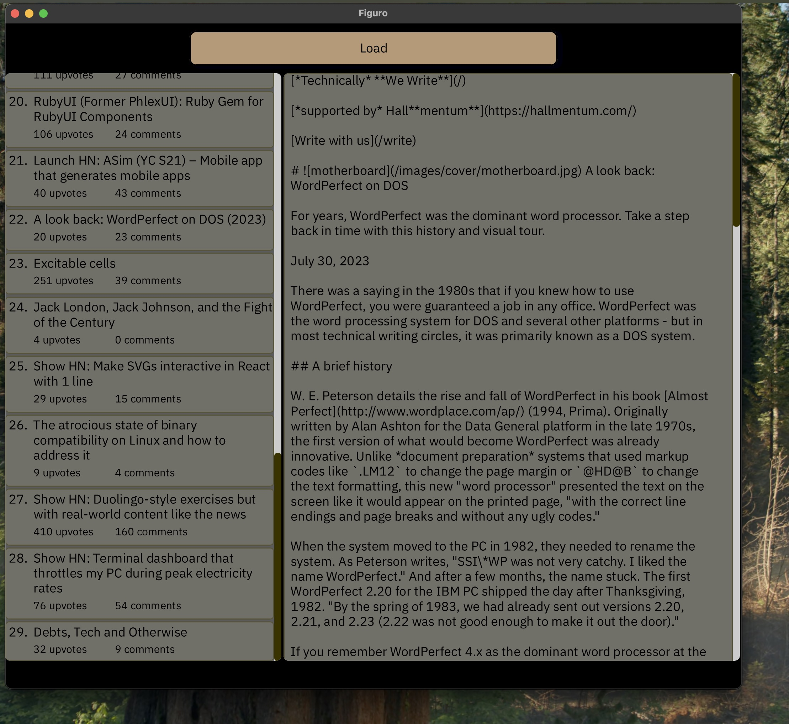
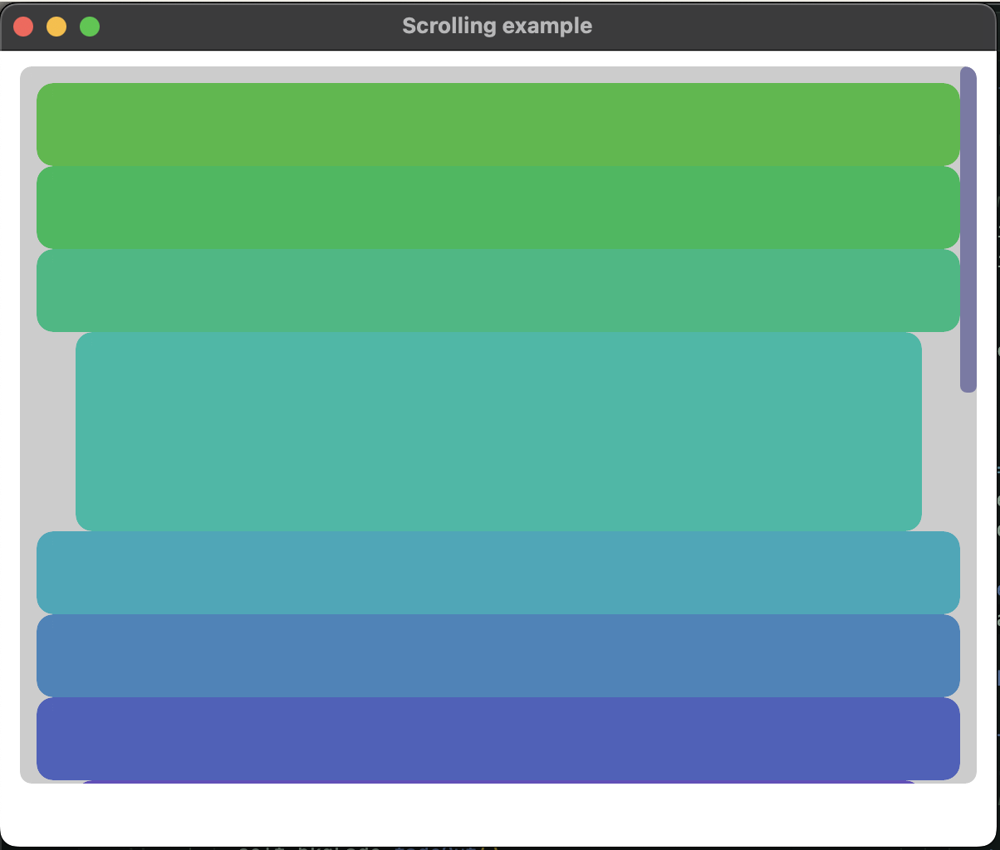

# Figuro

Figuro is a open source framework for building *beautiful*, *interactive*, and *efficient* applications. It compiles small binaries with support for multiple platforms.

By building on some of the best parts of GUI development in last 2 decades years Figuro incorporates the best elements of both imperitive, object oriented, and declarative GUI toolkits.

Originally based on Fidget, Figuro has now diverged quite significantly and includes a multi-threaded core, typed widgets, reactive event system, and CSS theming.

*Note*: Figuro is now in an *beta* stage with all the key pieces working. There's likely to be churn in the APIs but it's mostly stabalized. 

## Demo: HNBrowser



Example theming:


## Example



Example drawing buttons with a fading background when any of them are hovered (see below for how it works):

```nim
import figuro/widgets/[button, scrollpane, vertical]
import figuro

let
  font = UiFont(typefaceId: defaultTypeface(), size: 22)

type
  Main* = ref object of Figuro
    value: float

proc buttonItem(self, this: Figuro, idx: int) =
  Button.new "button":
    size 1'fr, 50'ux
    fill rgba(66, 177, 44, 197).to(Color).spin(idx.toFloat*50)
    if idx in [3, 7]:
      size 0.9'fr, 120'ux

proc draw*(self: Main) {.slot.} =
  withWidget(self):
    with this:
      fill css"#0000AA"
    ScrollPane.new "scroll":
      offset 2'pp, 2'pp
      cornerRadius 7.0'ux
      size 96'pp, 90'pp
      Vertical.new "":
        offset 10'ux, 10'ux
        contentHeight cx"max-content"
        for idx in 0 .. 15:
          buttonItem(self, this, idx)

var main = Main.new()
var frame = newAppFrame(main, size=(600'ui, 480'ui))
startFiguro(frame)
```

## Installation - Trying it out

Figuro now uses Nimble by default.

First install the latest Nimble version or at least version 0.18:
```sh
nimble install nimble
```

Next install Figuro: 
```sh
nimble install https://github.com/elcritch/figuro
```

Alternatively to run the tests you can do:
```sh
git clone https://github.com/elcritch/figuro
cd figuro && nimble install --deps
```

### Systems without OpenGL 3.3

It's possible to use EVGL:

```sh
nim c -d:useOpenGlEs ...
```
## Widgets

Figuro builds Figuro (UI) nodes. Each node has a basic set of properties that can be set and a core set of events and methods somewhat similar to HTML DOM elements. The two core node types are Rectangle and Text. More node types can be created by making widgets.

Widgets are nodes that sub-class a `Figuro` node type and provide a custom `draw` method (slot). The common way to create a Figuro app is creating a `Main` widget.

Here's a minimal example of creating a blue rectangle:

```nim
type Main* = ref object of Figuro

proc draw*(self: Main) {.slot.} =
  withWidget(self):
    Rectangle.new "body":
      # each widget template injects a new `this` variable
      # that references the current widget

      # sets the bounding box of this node
      box this, 10'ux, 10'ux, 600'ux, 120'ux

      # set the fill color
      fill this, css"00001F"

var main = Main.new()
let frame = newAppFrame(main, size=(400'ui, 140'ui))
frame.startFiguro()
```

Note that rectangle is used enough that it also has a shortcut template `rectangle` that can be used:

```nim
proc draw*(self: Main) {.slot.} =
  withWidget(self):
    rectangle "body":
      # each widget template injects a new `this` variable
```

## Manual Node Setup

The follow example shows how to setup a child node without using the default `new` template. However, generally using the `new` templates is encouraged as the internals may need to change.

```nim
proc draw(self: Main) {.slot.} =
  setName self, "main"
  fill self, css"#9F2B00"
  box self, 0'ux, 0'ux, 400'ux, 300'ux

  let this = self
  let childPreDraw = proc (c: Figuro) =
    let this {.inject.} = Button[int](c)
    box this, 40'ux, 30'ux, 80'ux, 80'ux
    fill this, css"#2B9F2B"
    let childPreDraw = proc (c: Figuro) =
      let this {.inject.} = Text(c)
      box this, 10'ux, 10'ux, 80'pp, 80'pp
      fill this, blackColor
      setText(this, [(font, "testing")], Center, Middle)
    widgetRegisterImpl[Text](nkText, "btnText", this, childPreDraw)

  # same as: widgetRegisterImpl[Button[int]](nkRectangle, "btn", this, childPreDraw)
  let fc = FiguroContent(name: "btn", childInit: nodeInitRect[Button[int]], childPreDraw: childPreDraw)
  this.contents.add(fc)
```

## Signals and Slots

Figuro uses [Sigils](https://github.com/elcritch/sigils) which implements methods using signals and slots. Slots are methods which are connected to Signals on a given object and are invoked when the signal is trigged on that object.

This comes from [QT](https://doc.qt.io/qt-6/signalsandslots.html) and is a very powerful and flexible paradigm while still being very fast. It allows built-in reactive data types similar as well. It can also support "deferred" runs and support for running in threads or thread pools and largely prevents data-races.

Finally it allows Figuro to be very flexible and to provide support for network RPCs, dynamic method realoding, and browser web-assembly in the future.

## Goal

Massive profits and world domination of course. ;) Failing that the ability to write cool UI apps easily, in pure Nim.

### Useful Compilation Flags

- `-d:debugLayout` prints a node tree with the layout of each node before and after computing a layout

### Drawing model

Each widget must inherit from the `Figuro` type. `Figuro` itself inherits from `Agent` which means it can work with signals & slots.

Each widget is composed of a `draw` slot and a widget-macro which is exported using `exportWidget`. Draw slots expect the widget object to already be created.

The purpose of the widget macro which sets up a new block, calls `preNode()` and `postNode()` with the user code inserted into a anonymous callback. This callback is called by the `postNode()` proc by emitting a `doDraw` signal.

Each `doDraw` signal on a widget is connected to multiple slots which ready a widget for drawing, runs pre-draw callbacks, run any widget draw slot, and runs post-draw callbacks. User code passed to the widget-macros become the pre-draw callback for that widget instance. For advanced needs, a post-draw callback can be manually supplied.  

### Layout and Controlling Widget Size and Position

There are two modes of layout: basic and grid. Both of these use the same core set of layout constraints which can be used to configued the width & height or the offset in x & y. Normally layout constraints are referred to as just constraints for brevity. The basic APIs are `box`, `size`, and `offset` which all set layout constraints. Each widget has a `box` which can manually set the position, but can be overwritten by the layout system. It's recommended to avoid directly modifying it. Instead set `cxOffset` and `cxSize`.

Simple example:

```nim
proc draw*(self: Main) {.slot.} =
  nodes self:
    fill "#0000AA"
    size 100'pp, 100'pp ## this will set to 100 percent
                        ## of the parents width and height
                        ## Note this is a root object
                        ## so it's parent is considered the window
                        ## size
    rectangle "container":
      offset 20'ux, 20'ux ## offsets container 20'ux (aka 20'ui) points
      size 90'pp, 80'pp ## sets width to 90 perc and 80 percent of parents width
      clipContent true
      cornerRadius 10.0
      text "val":
        ## No size or position given defaults to `UiNone`. This defaults
        ## to the free size of it's parent after offsets are subtracted
        setText({font: "hello world!"}, Center, Middle)

```

The layout constraints are modeled on [CSS Grid](https://css-tricks.com/snippets/css/complete-guide-grid/) and for more advanced layouts understanding CSS Grid will be helpful. The reason for this is that CSS Grid is one of the most flexible layout systems avaialable on the web and yet remains simple to use once you understand the basics, unlike alternatives like flexbox or even raw table layouts.

Note that the easiest way to set layout constraint values are to use their numeric literal types. These are:

- `1'fr` for fraction
- `1'ux` for fixed ui coordinates
- `100'pp` for percentage
- `cx"auto"` or `csAuto()` is the default and uses the full available size of it's parent size (current.wh = parent.wh - current.xy)
- `1'ux` is equivalent to `1'ui` which is just a UICoord scalar
- `ux(1+i*2)` to convert expressions to fixed ui coordinates
- `cs"min-content"` minimum content size (currently grid layout only)
- `cs"max-content"` minimum content size (currently grid layout only)

Helper proc's for formula based constraints are `csFixed(x)`, `csMin(x,y)`, `csMax(x,y)`, `csMinMax(x,y)`, and `csMinMax(x,y)`. Note that the multi-argued constraints are still a WIP and don't work currently.

Internally a layout constraint, normally shortened to just *constraint*, is formed from two pieces: the `Constraint` container object and an optional inner `ConstraintSize` object. 

#### CSS Grid Layout

A CSS Grid layout allows you to create either a fixed pre-sized grid or a dynamically expandable grid.

##### CSS Grid Automatic Vertical Layout

This example shows how to setup a *vertical group* using a CSS Grid with one full width column (set by `setGridCols 1'fr`). It grows by adding new rows with a height of `60ux` (set by `gridAutoRows 60ux`) whenver more child widgets are added. Items are vertically aligned (`alignItems CxStart`) and horizontally justified (`justifyItems CxCenter`). The child widgets have their sizes set to `size 60'ux, 40'ux`. Alternatively `CxStretch` could be used to force the child widgets to take up a whole column and row.

```nim
    rectangle "main":
      fill whiteColor
      offset 30'ux, 10'ux
      size 400'ux, 120'ux

      setGridCols 1'fr
      setGridRows 60'ux
      gridAutoRows 60'ux
      gridAutoFlow grRow
      justifyItems CxCenter
      alignItems CxStart

      rectangle("slider"):
        size 60'ux, 40'ux
        fill "#00A0AA"
      rectangle "slider":
        size 60'ux, 40'ux
        fill "#A000AA"
```

#### Constraint Reference Table

Here's the full list of options (see CSS Grid for more details): 

```nim
type
  ConstraintSizes* = enum
    UiAuto ## default size option for nodes
           ## it's the size of the parent width/height 
           ## minus the x/y positions of the node
    UiFrac ## represents `fr` aka CSS Grid fractions
    UiPerc ## represents percentage of parent box or grid
    UiFixed ## represents fixed coordinate size
    UiContentMin ## represents layout to use min-content, `cmin` is calculated internally
    UiContentMax ## represents layout to use max-content, `cmax` is calculated internally

  Constraints* = enum
    UiValue ## holds a single `ConstraintSize`
    UiMin ## minimum of lhs and rhs (partially supported)
    UiMax ## maximum of lhs and rhs (partially supported)
    UiSum ## sum of lhs and rhs (partially supported)
    UiMinMax ## min-max of lhs and rhs (partially supported)
    UiNone ## none item - excluded from CSS Grid layout & basic layout
    UiEnd ## marks end track of a CSS Grid layout
```

### CSS Grid Layout Examples

Example layouts using CSS Grid:
- https://css-irl.info/solving-a-tricky-layout-problem/
- https://apiumhub.com/tech-blog-barcelona/css-grid/


